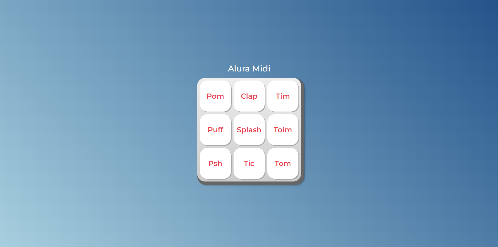

## Visão Geral

### O projeto

- Fazer um pequeno teclado com sons
- Poder utilizar as teclas do teclado (TAB, ENTER, ESPAÇO) para escutar os sons

### Screenshot

### Links

- Live Site URL: [Alura Midi](https://alura-midi-two-zeta.vercel.app/)

## Meu processo

### Criado com

- JavaScript
- HTML e CSS fornecidos pelo curso

### O que eu aprendi

- Aprendi a usar .play()
- Aprendi a usar .onkeyup()
- Aprendi a usar .onkeydown()
- Aprendi a usar .onclick()

## Autor

- GitHub - [João Metzdorf](https://github.com/joaometzdorf)
